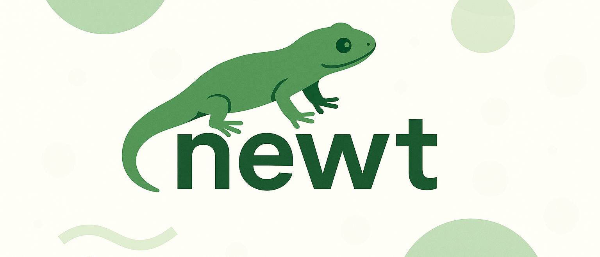

# newt

Manage Git worktrees with ease. `newt` is a simple wrapper around Git worktrees that automatically organizes them in a `.newt/` directory, provides merge status tracking, and handles deletion.

## Usage

```text
newt [-b] <branch>
newt -d <worktree>
newt -l
```

### Options

- `<branch>`: Create a worktree for the specified branch in `.newt/<branch>`. Slashes in branch names are converted to hyphens in the directory name.
- `-b`: Create a new branch and worktree together.
- `-d <worktree>`: Delete the specified worktree and its branch. Asks for confirmation if the branch has not been merged.
- `-l`: List all worktrees with their merge status (merged/unmerged relative to the default branch).
- `-h`, `--help`: Print help and exit.
- `-v`, `--version`: Print version and exit.

### Examples

Create a worktree for an existing branch:

```shell
newt feature/new-api
# Creates .newt/feature-new-api/ and opens a shell there
```

Create a new branch and worktree:

```shell
newt -b bugfix/issue-123
# Creates new branch and .newt/bugfix-issue-123/ worktree
```

List all worktrees with merge status:

```shell
newt -l
# Shows worktrees with their branches and merge status
```

Delete a worktree and its branch:

```shell
newt -d feature-new-api
# Removes the worktree and deletes the branch
# Asks for confirmation if the branch hasn't been merged
```

## Installation

### macOS via Homebrew

```shell
brew install cdzombak/oss/newt
```

### Debian via apt repository

Install my Debian repository if you haven't already:

```shell
sudo apt-get install ca-certificates curl gnupg
sudo install -m 0755 -d /etc/apt/keyrings
curl -fsSL https://dist.cdzombak.net/deb.key | sudo gpg --dearmor -o /etc/apt/keyrings/dist-cdzombak-net.gpg
sudo chmod 0644 /etc/apt/keyrings/dist-cdzombak-net.gpg
echo -e "deb [signed-by=/etc/apt/keyrings/dist-cdzombak-net.gpg] https://dist.cdzombak.net/deb/oss any oss\n" | sudo tee -a /etc/apt/sources.list.d/dist-cdzombak-net.list > /dev/null
sudo apt-get update
```

Then install `newt` via `apt-get`:

```shell
sudo apt-get install newt
```

### Manual installation from build artifacts

Pre-built binaries are downloadable from each [GitHub Release](https://github.com/cdzombak/newt/releases). Debian packages for each release are available as well.

### Build and install locally

```shell
git clone https://github.com/cdzombak/newt.git
cd newt
make build

cp out/newt-[VERSION]-all $INSTALL_DIR/newt
```

### Shell Completions

Shell completion scripts are available in the `completions/` directory.

#### Bash

Add to your `~/.bashrc` or `~/.bash_profile`:

```shell
source /path/to/newt/completions/newt.bash
```

Or copy the completion script to your system's bash completions directory:

```shell
# macOS (Homebrew)
cp completions/newt.bash $(brew --prefix)/etc/bash_completion.d/newt

# Linux
sudo cp completions/newt.bash /etc/bash_completion.d/newt
```

#### Zsh

Copy the completion script to a directory in your `$fpath`:

```shell
# Example: using ~/.zsh/completions
mkdir -p ~/.zsh/completions
cp completions/_newt ~/.zsh/completions/
```

Then add to your `~/.zshrc` (before `compinit`):

```shell
fpath=(~/.zsh/completions $fpath)
autoload -Uz compinit && compinit
```

Or for Homebrew users:

```shell
cp completions/_newt $(brew --prefix)/share/zsh/site-functions/_newt
```

## About

- Issues: [github.com/cdzombak/newt/issues](https://github.com/cdzombak/newt/issues)
- Author: [Chris Dzombak](https://www.dzombak.com)
  - [GitHub: @cdzombak](https://www.github.com/cdzombak)

## License

MIT; see `LICENSE` in this repository.
